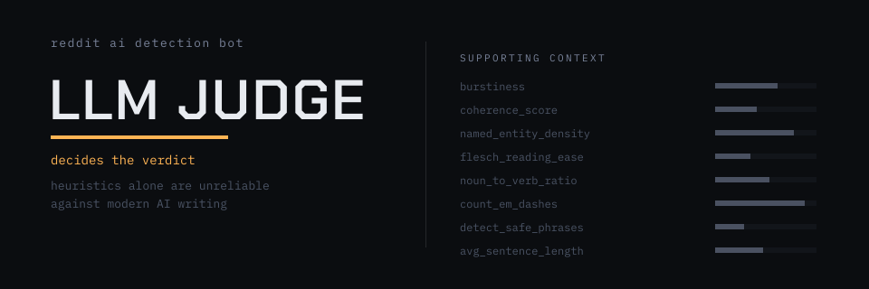

# Reddit AI Detection Bot



A Reddit bot that judges whether a post is likely AI-generated using an LLM judge
(Claude Sonnet 5), with local statistical signals (perplexity, coherence, named-entity
density, etc.) passed in as supporting context rather than the deciding factor —
statistical heuristics alone are unreliable against modern AI writing. Falls back to
local heuristic scoring if no Anthropic API key is configured or a judge call fails.

Designed for easy deployment on [Render.com](https://render.com/) or similar platforms.

## Features
- Trigger-based post analysis (mention or `!aicheck` command)
- LLM-judge verdicts via the Claude API, with local heuristics as supporting context
- Graceful fallback to local heuristic scoring if the LLM judge is unavailable
- Logging for transparency
- Environment variable support for secrets

## Setup
1. **Clone the repository**
2. **Create and activate a virtual environment**
3. **Install dependencies**
   ```bash
   pip install -r requirements.txt
   ```
4. **Configure environment variables**
   - Copy `.env.example` to `.env` and fill in your Reddit app credentials and `ANTHROPIC_API_KEY`

## Running the Bot
```bash
python bot.py
```

## Deployment
- Ready for deployment on [Render.com](https://render.com/) (Dockerfile or native Python)
- Minimal resource usage for free/cheap hosting

## Project Structure
- `bot.py` — Main bot logic
- `ai_judge.py` — LLM-judge AI-detection call (Claude Sonnet 5)
- `local_detection.py` — Local statistical heuristics (used as judge context and fallback scoring)
- `requirements.txt` — Python dependencies
- `.env.example` — Environment variable template
- `todo.md` — Development task list

## License
MIT 